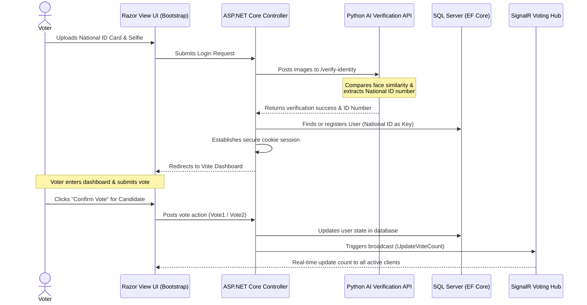

# 🗳️ Biometric E-Voting System

A secure, real-time E-Voting platform that utilizes AI-powered biometric identity verification, secure claim-based session management, and live vote count synchronization. 

The system allows citizens to securely register and log in by uploading their national ID card and a selfie. Once verified, they can cast their vote, which is securely persisted and instantly broadcasted to all active client dashboards in real-time.

---

## 🏗️ System Architecture & Workflow

The diagram below illustrates the authentication, biometric verification, voting, and real-time broadcasting sequence:

---

## 🚀 Key Features

* **Biometric Identity Verification**: Uploads national ID cards and selfies to verify similarity thresholds ($0.45$ matching) and extract English-digit national identifiers automatically.
* **Secure Session Management**: Built on **ASP.NET Core Identity**, ensuring that user sessions are encrypted, claims-based, and protected against cross-site request forgery (`[ValidateAntiForgeryToken]`).
* **Real-time Live Tallies**: Leverages **SignalR Hubs** to broadcast and update vote counters dynamically across all connected voter dashboards without page refreshes.
* **Fintech-Inspired UI**: A responsive, modern glassmorphic dashboard built using CSS3 transitions, animations, and Bootstrap modal controls.

---

## 🛠️ Tech Stack

* **Backend Framework**: .NET 8 (ASP.NET Core MVC)
* **Real-time Communication**: ASP.NET Core SignalR
* **Database & ORM**: SQL Server, Entity Framework Core (Code-First Migration)
* **Authentication**: ASP.NET Core Identity (Customized `User` schema)
* **Frontend**: Razor Views (CSHTML), Bootstrap 5, JavaScript (ES6+), SignalR JS Client
* **Biometric API Client**: HttpClient (Multipart Form-Data integration)

---

## 🔒 Security Measures
* **Anti-Forgery Checks**: Every state-mutating request uses `@Html.AntiForgeryToken()` to prevent CSRF attacks.
* **14-Digit Key Constraining**: The database schema enforces unique national ID parameters to avoid double-voting.
* **Persistent Sessions**: Secure cookie validation policies for authenticated users.
